# 青软实训 青岛试讲

> 作者: 张大鹏

## 个人简介

- 姓名: 张大鹏
- 性别: 男
- 公司: 青软教育科技股份有限公司
- 经验:18年加入青软实训，主要授课是《Python程序设计》、《Python数据科学》、《Linux操作系统》、《数据分析》等课程。
- 地点：德州


## 个人补充

- **抖音**: `lxgzhw`,中文名理想国真恵玩. 18年10开通-至今, 每天坚持发一些学习笔记和技术视频, 已有5.2万粉丝, 较受大家喜欢.
- **线上教学**: 除了线下教学外,还提供线上教学. 主要通过`YY`, 抖音直播, 虎牙直播等个人直播平台进行教学, 主要教授Python基础知识, 数据库, Python Web项目实战, 爬虫等课程. 学生中有海外的留学生, 国内企业高管等.
- **北科大小学期实训**: 2019年7月-9月, 曾参加北京科技大学的小学期培训. 培训主要针对在校计算机相关专业的大三学生, 主要内容是 **`Python Web + AI`** ,我全程负责`Python Web`模块的教学计划制定, 上课, 课后辅导, 学生项目辅导等. 该次培训最终每个学生都独立完成了自己的 **`Web + AI`** 的项目, 以校内老师两名+校外培训讲师一名的形式最终进行考核, 校内老师十分满意, 学生项目最高分高达**97分**, 出现了**手势控制博客**, **智能聊天机器人**, **电影智能推荐系统**, **歌词情感分析系统** 等一系列优秀的作品.


## 试讲标题

- 如何从自己喜欢的网站上下载数万张图片


## 试讲目录

- 1.什么是爬虫
- 2.为什么选用Python做爬虫
- 3.动手写一个爬虫,感受一下爬虫的魅力


## 试讲内容

### 1.什么是爬虫?

百科定义

```
网络爬虫（又称为网页蜘蛛，网络机器人，在FOAF社区中间，更经常的称为网页追逐者），是一种按照一定的规则，自动地抓取万维网信息的程序或者脚本。另外一些不常使用的名字还有蚂蚁、自动索引、模拟程序或者蠕虫。
```

简单的理解

```
1.爬虫是一种网页蜘蛛.
为什么呢? 我们都知道,蜘蛛喜欢在自己的网上爬来爬去的,而几乎也只生活在自己的网上.
提到网,大家应该很快就能够想到"上网","网吧","网络"等词.
我们如今生活在网络时代,平时所说的上网,实际上,是进入到巨大的"互联网",这个互联网由一个又一个的站点组成.
而爬虫,就是我们写的程序,则像是一个冲锋的战士,不知疲倦的在这张巨大的网上爬来爬去进行工作,如此,我们形象的将爬虫称之为网页蜘蛛.
```

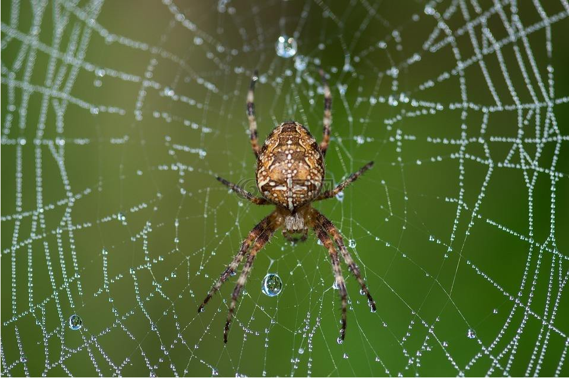

```
2.爬虫是网络机器人
为什么呢?想到机器人,大家脑海中应该会情不自禁的想到"不知疲倦","执行任务","没有情感"等词汇.
而爬虫,实际上就是我们开发的,不知疲倦的执行特定任务的,没有情感的,功能强大的网络程序,所以也被形象的成为网络机器人.
```


```
3.百度搜索,谷歌搜索等都属于爬虫
```


```
4.爬虫的核心是,模拟用户的浏览器行为
```

```
延伸阅读: 谷歌创始人就是做爬虫起家的,所以希望大家好好学爬虫,开创下一个谷歌,甚至超越谷歌
```

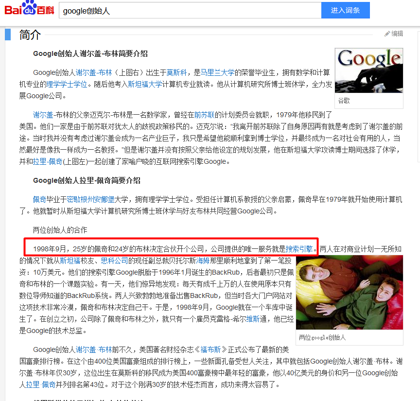


### 2.为什么用python写爬虫?

- 1.人生苦短,我用Python
- 2.比简洁:Python有`requests`这样简单,优雅,上手快,功能强大的库
- 3.比完整:Python有`Scrapy`这样功能强大,完整的爬虫框架
- 4.个人认为,最重要的还是技术栈,选择Python,可以用requests做爬虫,将数据封装进数据库,可以用`pymysql`灵活的调取数据库信息,不管是结合flask做`api`,还是结合`numpy,pandas,matplotlib`等库用来做数据分析,都十分容易


### 3.动手写一个爬虫

此部分参考下面的爬虫实战


## 爬虫实战

**步骤分析**

```
1.搭建开发环境 Python3.7 或 Anaconda(推荐) 和 pycharm
2.安装依赖包 requests,bs4,lxml
3.准备要爬取的网址 http://pic.netbian.com/index_5.html
4.准备用户代理 User-Agent: Mozilla/5.0 (Windows NT 10.0; Win64; x64; rv:69.0) Gecko/20100101 Firefox/69.0
5.写爬虫
6.运行爬虫
```


### 1.搭建开发环境

```
下载Python3.7
https://www.python.org/downloads/
```


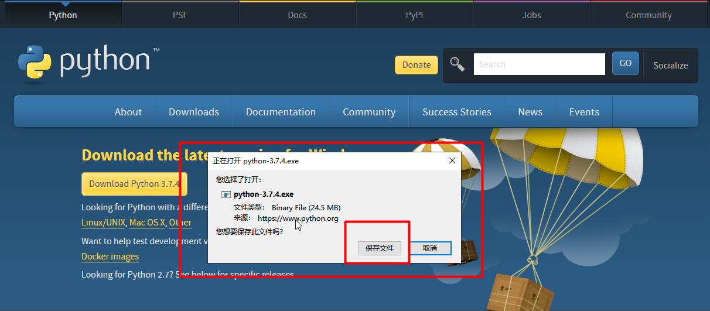

安装很简单,直接一直下一步即可,不再赘述

但是这里有个比较重要的步骤,安装好了以后,需要搭建虚拟环境

```
pip install virtualenv
```

以下为常用命令

```
# 创建虚拟环境
virtualenv env

# 激活虚拟环境
# 进入到env下面的Scripts文件夹(windows)或bin文件夹(Linux)
activate

# 退出虚拟环境
deactivate
```


```
下载Anaconda
# 清华镜像网址
https://mirror.tuna.tsinghua.edu.cn/anaconda/archive/
```

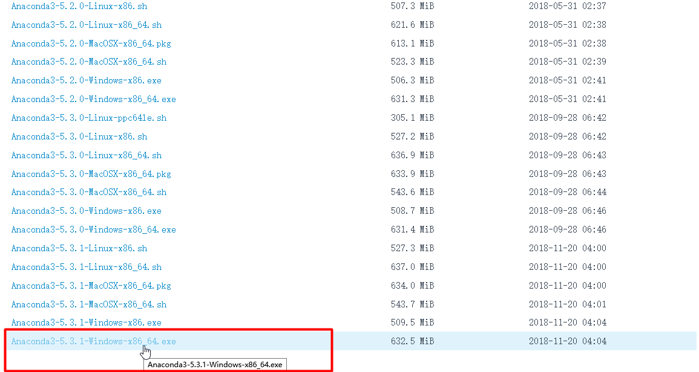

点击下载即可,安装较简单,不再赘述

如果你装的是Anaconda,则可能需要使用以下命令

```
# 创建虚拟环境
conda create -n 虚拟环境名称 要安装的依赖包,至少一个

# 激活虚拟环境
conda activate 虚拟环境名称

# 退出虚拟环境
conda deactivate

# 查看虚拟环境列表
conda env list

# 删除虚拟环境
# 或者直接去envs下面删除对应的虚拟环境包也可以
conda remove -n 虚拟环境名称 --all
```


```
安装Pycharm
# 下载地址
http://www.jetbrains.com/pycharm/download/#section=windows

# 安装教程
https://www.runoob.com/w3cnote/pycharm-windows-install.html
```


### 2.安装依赖包

这里我用windows+anaconda+pycharm进行开发

```
# 创建一个爬虫虚拟环境
conda create -n spider1910 requests
```

```
# 然后用pycharm创建一个爬虫项目,选择创建的虚拟环境
# 位于anaconda安装目录的envs文件夹
```

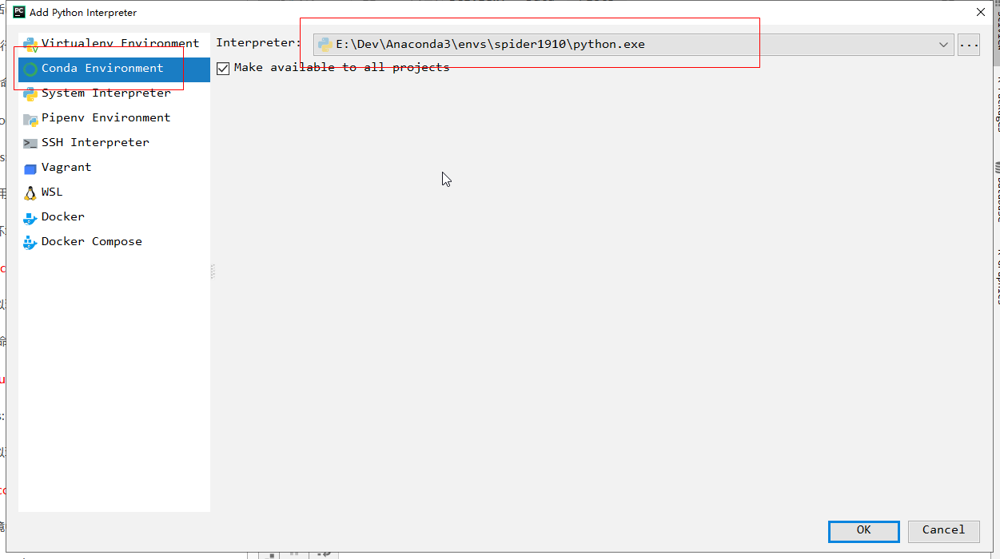

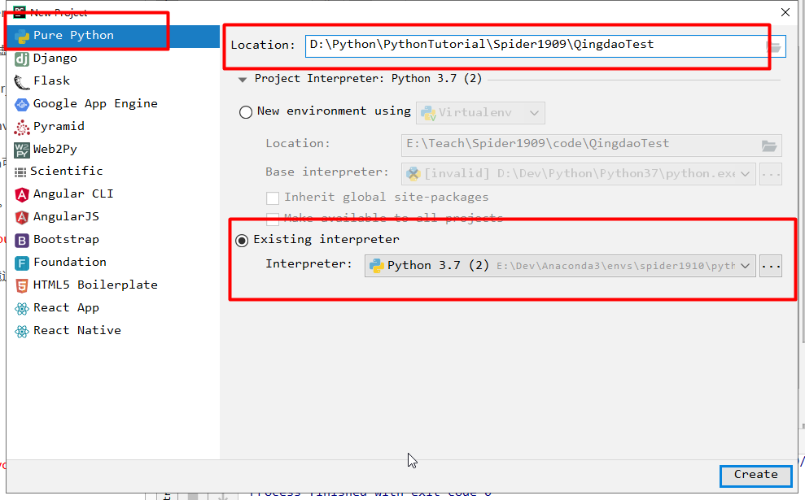

创建项目后,打开终端

先切换到我们创建的虚拟环境

```
conda activate spider1910
# 查看已安装的包
pip freeze
```

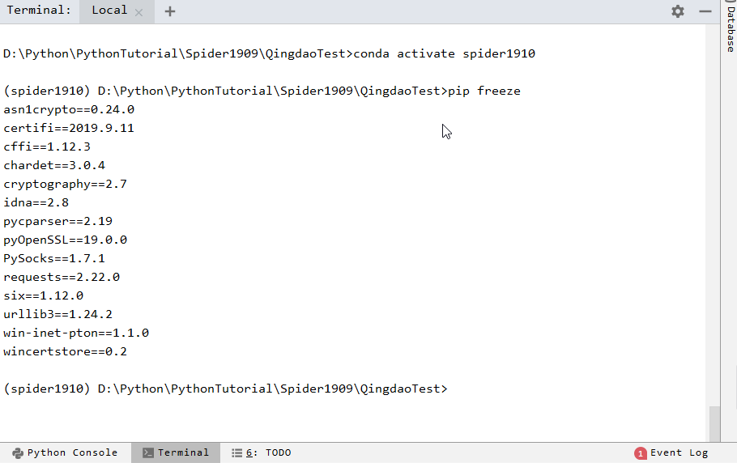


安装其他依赖

```
pip install lxml
pip install bs4
```

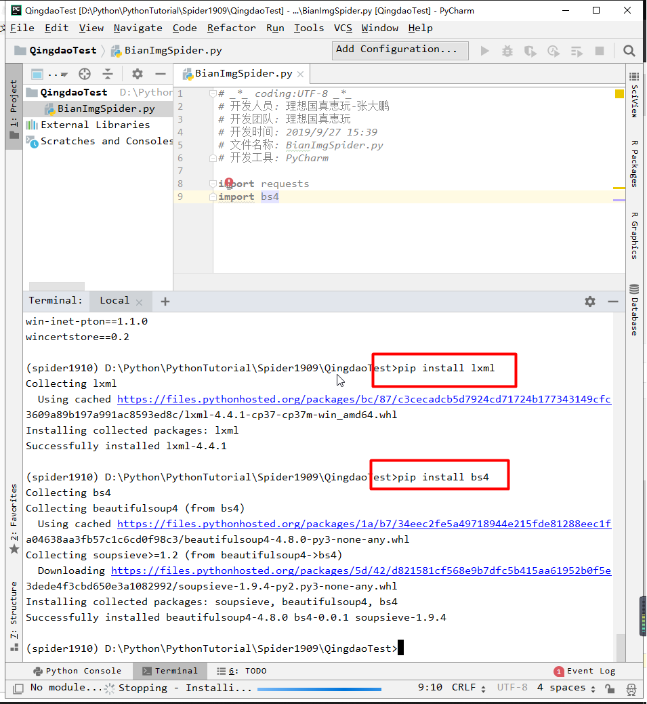


### 3.准备要爬取的网址

```
# 浏览器打开以下网址,这里用火狐浏览器
http://pic.netbian.com/index_5.html
```


### 4.准备用户代理

```
User-Agent: Mozilla/5.0 (Windows NT 10.0; Win64; x64; rv:69.0) Gecko/20100101 Firefox/69.0
```

鼠标右键,查看元素

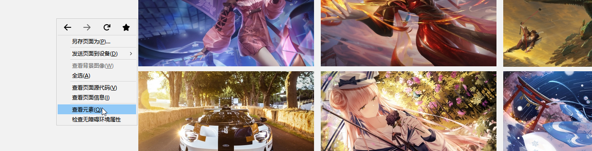

点网络,`ctrl+r`刷新,然后随便点一个网址

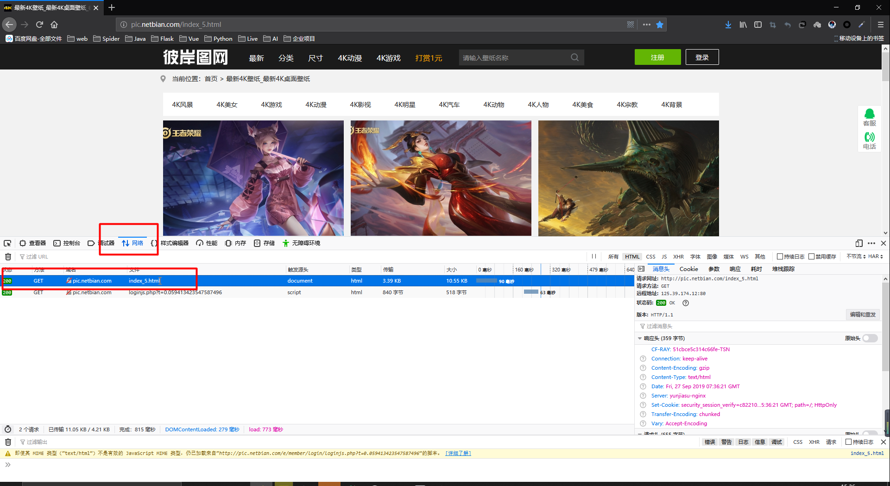

右侧,点显示原始请求头,赋值`User-Agent`

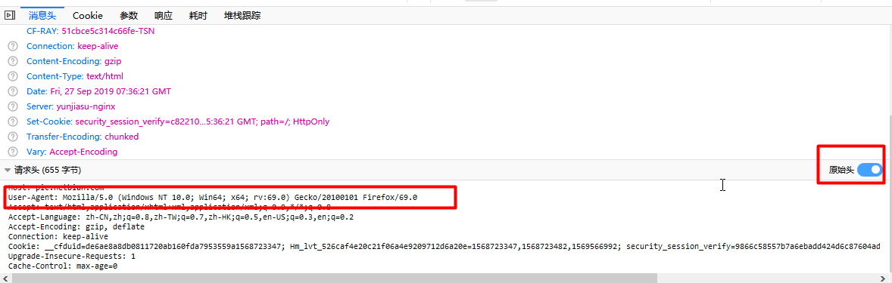

### 5.写爬虫

```python
# _*_ coding:UTF-8 _*_
# 开发人员: 理想国真恵玩-张大鹏
# 开发团队: 理想国真恵玩
# 开发时间: 2019/9/27 15:39
# 文件名称: BianImgSpider.py
# 开发工具: PyCharm

import requests, os, time
from bs4 import BeautifulSoup


# 1.准备url和请求头
# 2.发送get,获取响应数据,转换为html
# 3.提取本页图片和下一页地址
# 4.保存图片
# 5.循环执行第三步操作
class BianImgSpider:
    def __init__(self, url, base_url='http://pic.netbian.com'):
        self.base_url = base_url
        self.url = url
        self.headers = {"User-Agent": "Mozilla/5.0 (Windows NT 10.0; Win64; x64; rv:69.0) Gecko/20100101 Firefox/69.0"}
        self.has_next = True  # 判断是否有下一页

    def get_html(self):
        """
        获取url地址的html源码
        :return: html源码
        """
        response = requests.get(self.url, headers=self.headers)
        response.encoding = 'gbk'
        return response.text

    def get_imgs_next_url(self):
        """
        获取图片本页的图片列表和下一页的地址
        :return: 图片列表,下一页url
        """
        print("正在爬取网页:", self.url)
        html = self.get_html()
        # print(html)
        # exit()
        soup = BeautifulSoup(html, 'lxml')
        img_list = soup.select('.slist ul li a img')
        # print(img_list)
        # 提取图片的src,装进列表
        imgs = []
        for i in img_list:
            src = i['src']
            src = self.base_url + src
            # print(src)
            # exit()
            imgs.append(src)
        # 提取下一页
        try:
            # next_url = soup.select('.page > a:nth-child(13)')[0]
            # print(next_url['href'])
            # exit()
            # 找到page
            page = soup.select('.page')[0]
            # print(page, type(page))
            # 下一页是最后一个a
            # print(page.a)
            # print(page.contents)
            # print(page.contents[-1])
            href = page.contents[-1]['href']
            # print(href)
            next_url = self.base_url + href
            # print(next_url)
            return next_url, imgs
        except:
            print("没有下一页了")
            # 告知没有下一页了,方便操作
            self.has_next = False

    def save_img(self, imgs):
        """
        保存列表中的图片
        :param imgs: 图片列表
        :return: True
        """
        try:
            for img in imgs:
                # 提取图片名字
                # print(type(img))
                img_name = img.split('/')[-1]
                # print(img_name)
                # 设置图片保存地址
                save_path = 'imgs'
                if not os.path.exists(save_path):
                    os.mkdir(save_path)
                response = requests.get(img, headers=self.headers)
                # 获取图片流
                with open(save_path + "/" + img_name, 'wb') as f:
                    # 每次读写1M数据
                    for chunk in response.iter_content(1024):
                        f.write(chunk)
                # exit()
            print("一个图片列表被保存成功")
            return True
        except:
            print("保存失败")
            return False

    def run(self):
        """
        运行爬虫,保存图片
        :return: 成功返回True,失败返回False
        """
        try:
            while self.has_next:
                next_url, imgs = self.get_imgs_next_url()
                # print(imgs)
                # print(next_url)
                # 保存图片
                self.save_img(imgs)
                # 将url改为下一页的url
                self.url = next_url
                # 文明爬取,每爬取一页,休息一秒钟,防止破坏服务器
                time.sleep(1)
            return True
        except:
            print("保存图片失败")
            return False


if __name__ == '__main__':
    spider = BianImgSpider('http://pic.netbian.com/index_5.html')
    spider.run()
```


### 6.运行爬虫

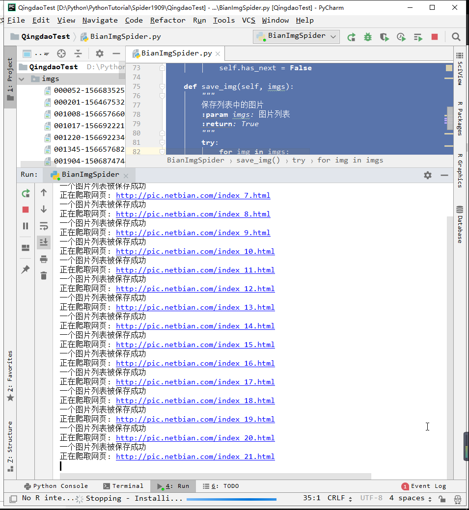

下载图片截图


## 完结感言

此教程为阿里上饶项目试讲所写

由于互联网信息千变万化,日新月异,此教程写与2019年9月27日,试讲为2019年9月29日,虽只相差两天时间,但如果该网站及时更新了反爬虫策略,也有可能会出现无法爬取的情况

如果无法爬取,可换讲如何下载单张网络图片以及下载整页网络图片


## 感谢大家

时间如流水,特别是程序员的时间,更是如同狂暴洪水,总是迅疾而易逝

感谢大家百忙中抽出时间听我讲课,祝大家早日学会技术,做自己想做的事情,为中国的进步乃至地球的进步奉献自己的力量


作者: 张大鹏

时间: 2019年9月27日下午16:33

